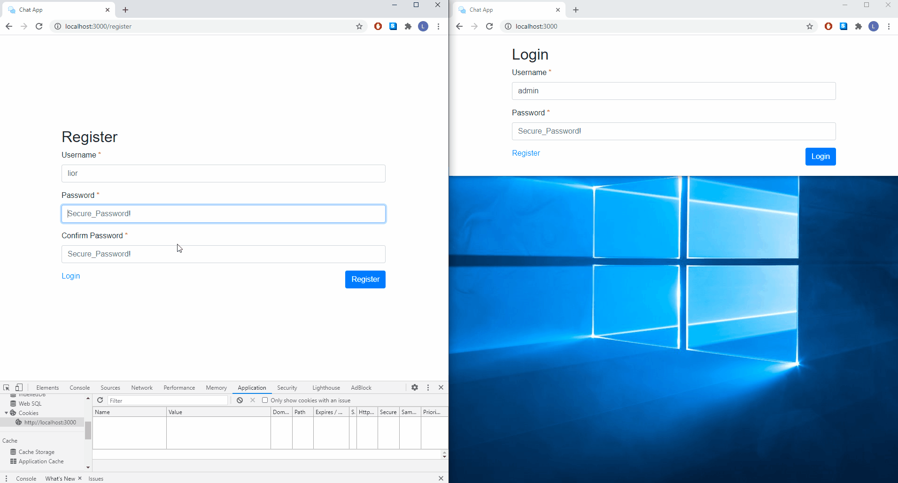

# ChatIn

## Description

A chat system with an admin and users that communicate with the admin.
The admin has a special namespace where they can see all active users that want to chat as well as "tabs" where the communication with unique users happens. A MongoDB database is used to persist the messages in each chat room in case of a reload/disconnect event.

## Demo

## Usage:

Visit https://lbragile-chat.herokuapp.com/

## Todo

##### Major

- [x] Get communication between client and admin to work
- [x] Admin must have a list of users to choose from to enter the chat room with.
- [ ] Database communication to store (persist) messages upon reload/disconnect.
- [ ] Optimize Style - make a button for chat pop out like Messenger.

##### Minor

- [ ] Registration page, password hashing and storage in database, email verification.
- [ ] Login persistence (cookies)

## Implementation Details:

- Bootstrap 4
- NodeJS & ExpressJS
- Socket.io
- MongoDB (Mongoose)
- **M**odel **V**iew **C**ontroller (MVC) Design Pattern
